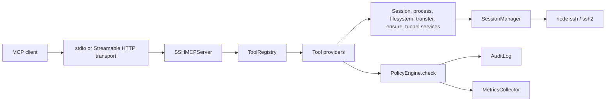

# Architecture

ssh-mcp-pro is organized around a small dependency-injected application container, an MCP server boundary, policy-aware tool providers, and SSH-backed services.

## System Diagram



Core request flow:

1. `SSHMCPServer` registers MCP tool, resource, and prompt handlers.
2. `ToolRegistry` resolves aliases and filters tools by connector profile.
3. Tool providers validate arguments and call services.
4. Services ask `PolicyEngine` before privileged or destructive work.
5. Policy decisions are recorded through `AuditLog` and `MetricsCollector`.
6. `SessionManager` owns SSH connection lifecycle and delegates to `node-ssh`, which uses `ssh2` underneath.

## Dependency Injection

`AppContainer` is the runtime dependency graph. It contains `ConfigManager`, `RateLimiter`, `MetricsCollector`, `AuditLog`, `PolicyEngine`, `SessionManager`, and `TunnelService`.

`createContainer()` builds the production graph from environment-backed `ConfigManager` settings. It enables the normal rate limiter behavior and wires session-close cleanup to tunnel cleanup.

`createTestContainer()` builds the same shape for tests while allowing targeted overrides. It disables blocking rate-limit behavior and uses shorter session defaults so unit tests can replace only the dependency they are exercising.

## MCP Server And Tool Registry

`SSHMCPServer` wraps the MCP SDK `Server`. It exposes tools, resources, and prompts over stdio by default and can be connected to another transport through `connect()`.

Tool calls pass through a global sliding-window rate limit first. Calls whose arguments include a top-level `sessionId` then pass through a second configurable `session:<id>` window so one busy SSH session cannot exhaust the entire server budget.

Streamable HTTP responses also include `X-RateLimit-Limit`, `X-RateLimit-Remaining`, and `X-RateLimit-Reset` headers derived from the current global limiter usage so HTTP clients can observe budget state before a hard rate-limit error.

`ToolRegistry` owns provider registration and dispatch. It supports compatibility aliases such as `ssh.openSession` -> `ssh_open_session`, filters tool exposure through the configured tool profile, and converts thrown project errors into typed `ToolErrorResponse` MCP error results with `structuredContent.error`, `code`, and `message`. Successful tool handlers must return either a JSON object or an explicit MCP `CallToolResult` with non-null `structuredContent`; every listed tool has a concrete `outputSchema` that describes the successful structured response shape exposed to clients.

## Policy Engine

The policy path is:

```text
MCP tool call -> provider argument validation -> PolicyEngine.check() -> allow, deny, or explain -> AuditLog record -> service action
```

Default policy denies root login, raw sudo, destructive commands, and destructive filesystem operations. In `explain` mode, providers can surface the policy decision without mutating remote state.

## Remote Control Plane

The remote control plane provides Streamable HTTP MCP access and a no-custody outbound agent model.

- `server-http.ts` hosts the HTTP MCP endpoint and enforces bearer or OAuth authorization.
- `remote/control-plane.ts` implements control-plane HTTP routes, OAuth 2.0 PKCE, GitHub identity exchange, protected resource metadata, agent enrollment, WebSocket agent communication, and MCP protocol negotiation using the installed SDK's supported protocol versions.
- `remote/websocket.ts` handles the persistent outbound agent channel.
- `RemoteStore` persists users, OAuth clients, authorization codes, remote agents, enrollment tokens, and audit events in SQLite.
- `remote/mcp-tools.ts` exposes administrative remote-agent tools behind control-plane scopes.

OAuth uses PKCE for browser-based authorization and validates access tokens before protected MCP operations. Enrollment tokens are one-time secrets stored only as hashes.

## Persistence

`RemoteStore` currently uses `node:sqlite` through `DatabaseSync`. The project pins Node.js versions that include this module. In Node 24.15.0, `node:sqlite` is still a Stability 1.2 release-candidate API, so the contingency path is to introduce `better-sqlite3` 11.x as a maintained native fallback before widening the runtime matrix or if `node:sqlite` becomes unavailable.

## ADR-001: Use `node:sqlite` For RemoteStore

Status: accepted.

Context: The remote control plane needs a small local database for OAuth clients, authorization codes, users, agents, enrollment tokens, and audit events.

Decision: Use `node:sqlite` instead of adding `better-sqlite3` immediately.

Rationale:

- Avoids native bindings in the default install path.
- Keeps the package installable through the pinned Node.js runtime without postinstall compilation.
- Fits the local control-plane storage model.
- The release-candidate status is acceptable because `engines.node` pins versions known to expose `node:sqlite`.

Consequence: If Node removes or materially changes `node:sqlite`, the fallback is `better-sqlite3` 11.x with an explicit migration issue and CI coverage on the affected Node versions.

## ADR-002: Use An In-Process Rate Limiter

Status: accepted.

Context: stdio deployments should not require Redis or another external service.

Decision: Use the in-process `RateLimiter` sliding-window log.

Rationale:

- Keeps local stdio usage dependency-free.
- Gives deterministic unit-test behavior.
- Limits accidental global and per-session tool-call bursts without requiring network infrastructure.

Consequence: Multi-instance HTTP deployments need an external rate-limiting layer at the reverse proxy or platform edge if they require global limits.

## ADR-003: `better-sqlite3` Fallback For RemoteStore

Status: contingency.

Context: `node:sqlite` is the default storage adapter. Startup now validates that the current Node.js build exposes a constructable `DatabaseSync` before opening the control-plane database. If that check fails on a supported deployment target, the maintained native fallback is `better-sqlite3`.

Decision: Keep `node:sqlite` as the default and document a direct fallback patch that can be applied if a pinned Node.js build removes or materially changes the API.

Fallback steps:

1. Install the fallback dependency:

   ```bash
   pnpm add better-sqlite3@^11.0.0
   ```

2. Replace the `createRequire`-based `node:sqlite` loader in `src/remote/store.ts` with:

   ```typescript
   import Database from "better-sqlite3";
   ```

3. Replace the `DatabaseSync` constructor call with:

   ```typescript
   this.db = new Database(filePath);
   ```

4. Keep the existing `prepare().get()`, `prepare().run()`, and `exec()` call sites. The `better-sqlite3` synchronous API supports the same access pattern used by `RemoteStore`.

5. Run the full verification chain on the affected Node.js versions before widening the runtime matrix:

   ```bash
   pnpm run typecheck
   pnpm test
   pnpm run check
   ```

Consequence: The default install remains native-dependency-free. The fallback path is documented with copy-paste steps, but adopting it must be accompanied by a dependency review, lockfile update, CI coverage, and release notes.
